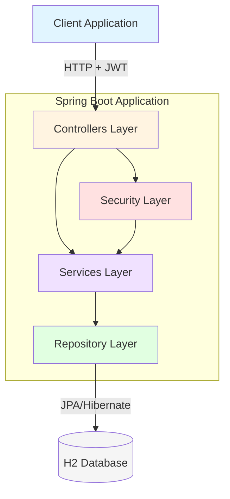

# SecureBlog

[](https://openjdk.java.net/)
[](https://spring.io/projects/spring-boot)
[](https://spring.io/projects/spring-security)
[](https://jwt.io/)

> A production-ready RESTful blog API built with Spring Boot, demonstrating secure authentication, clean architecture patterns, and enterprise-level backend development practices.

## Overview

SecureBlog is a robust backend application showcasing modern Spring Boot development with JWT-based stateless authentication, role-based access control, and clean separation of concerns. The project implements industry-standard security practices and RESTful API design principles.

## Architecture



## Tech Stack

| Category | Technologies |
|----------|-------------|
| **Language** | Java 21 |
| **Framework** | Spring Boot 3.x |
| **Security** | Spring Security 6.x, JWT (JSON Web Tokens) |
| **Persistence** | Spring Data JPA, Hibernate ORM |
| **Database** | H2 (Development) |
| **Mapping** | MapStruct |
| **Utilities** | Lombok |
| **Template Engine** | Thymeleaf |
| **Build Tool** | Maven |

## Features

### Authentication & Security
- **JWT-based Authentication**: Stateless token-based authentication system
- **Role-Based Access Control (RBAC)**: User and Admin roles with granular permissions
- **Password Encryption**: BCrypt hashing for secure password storage
- **Stateless Session Management**: No server-side session storage

### Core Functionality
- **Post Management**: Full CRUD operations with draft/published workflow
- **Category System**: Organize posts into hierarchical categories
- **Tagging**: Flexible multi-tag support for content organization
- **DTO Pattern**: Clean separation between entities and API contracts
- **Validation**: Comprehensive request validation with detailed error responses

### Developer Experience
- **H2 Console**: Built-in database console for development
- **MapStruct Integration**: Compile-time bean mapping for performance
- **Lombok**: Reduced boilerplate code with annotation processing
- **RESTful Design**: Standard HTTP methods and status codes

## Project Structure

```
src/main/java/com/secureblog/
├── controllers/
│   ├── AuthController.java
│   ├── PostController.java
│   ├── CategoryController.java
│   └── TagController.java
├── services/
│   ├── AuthService.java
│   ├── PostService.java
│   ├── CategoryService.java
│   ├── TagService.java
│   └── impl/
│       ├── AuthServiceImpl.java
│       ├── PostServiceImpl.java
│       ├── CategoryServiceImpl.java
│       └── TagServiceImpl.java
├── repositories/
│   ├── UserRepository.java
│   ├── PostRepository.java
│   ├── CategoryRepository.java
│   └── TagRepository.java
├── entities/
│   ├── User.java
│   ├── Post.java
│   ├── Category.java
│   ├── Tag.java
│   ├── Role.java (enum)
│   └── PostStatus.java (enum)
├── mappers/
│   ├── PostMapper.java
│   ├── CategoryMapper.java
│   └── TagMapper.java
├── security/
│   ├── BlogUserDetails.java
│   ├── BlogUserDetailsService.java
│   ├── JwtAuthenticationFilter.java
│   └── JwtUtil.java
├── config/
│   └── SecurityConfig.java
└── dtos/
    ├── request/
    │   ├── LoginRequest.java
    │   ├── CreatePostRequest.java
    │   └── UpdatePostRequest.java
    ├── response/
    │   ├── AuthResponse.java
    │   ├── PostDto.java
    │   ├── CategoryDto.java
    │   ├── TagDto.java
    │   └── ApiErrorResponse.java
```

## Security Overview

### Authentication Flow
1. Client sends credentials to `/api/v1/auth/login`
2. Server validates credentials and generates JWT token
3. Client includes JWT in `Authorization: Bearer <token>` header
4. `JwtAuthenticationFilter` validates token on each request
5. Security context populated with user details and roles

### Authorization Rules
- **Public Endpoints**: `/api/v1/auth/**`
- **User Access**: All authenticated users can create and manage their own posts
- **Admin Access**: Full CRUD access to all resources including categories and tags
- **Draft Posts**: Only visible to post author and admins

## API Endpoints

### Authentication
| Method | Endpoint | Access | Description |
|--------|----------|--------|-------------|
| POST | `/api/v1/auth/login` | Public | User authentication |

### Posts
| Method | Endpoint | Access | Description |
|--------|----------|--------|-------------|
| GET | `/api/v1/posts` | Public | List all published posts |
| GET | `/api/v1/posts/{id}` | Public | Get post by ID |
| GET | `/api/v1/posts/drafts` | User | List user's draft posts |
| POST | `/api/v1/posts` | User | Create new post |
| PUT | `/api/v1/posts/{id}` | User/Admin | Update post |
| DELETE | `/api/v1/posts/{id}` | User/Admin | Delete post |

### Categories
| Method | Endpoint | Access | Description |
|--------|----------|--------|-------------|
| GET | `/api/v1/categories` | Public | List all categories |
| GET | `/api/v1/categories/{id}` | Public | Get category by ID |
| POST | `/api/v1/categories` | Admin | Create category |
| PUT | `/api/v1/categories/{id}` | Admin | Update category |
| DELETE | `/api/v1/categories/{id}` | Admin | Delete category |

### Tags
| Method | Endpoint | Access | Description |
|--------|----------|--------|-------------|
| GET | `/api/v1/tags` | Public | List all tags |
| GET | `/api/v1/tags/{id}` | Public | Get tag by ID |
| POST | `/api/v1/tags` | Admin | Create tag |
| PUT | `/api/v1/tags/{id}` | Admin | Update tag |
| DELETE | `/api/v1/tags/{id}` | Admin | Delete tag |

## DTOs

### Request DTOs
- `LoginRequest` - User authentication credentials
- `CreatePostRequest` - New post creation payload
- `UpdatePostRequest` - Post update payload
- `CreateCategoryRequest` - Category creation payload
- `CreateTagRequest` - Tag creation payload

### Response DTOs
- `AuthResponse` - JWT token and user details
- `PostDto` - Post data transfer object
- `CategoryDto` - Category data transfer object
- `TagDto` - Tag data transfer object
- `ApiErrorResponse` - Standardized error response

## Author

**Your Name**  
[GitHub](https://github.com/AbbasZaidi11) • [LinkedIn](www.linkedin.com/in/abbaszaidi11)

---

⭐ If you liked this project, please consider giving it a star!
